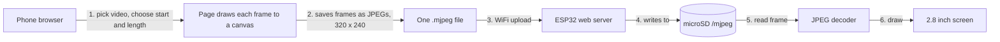
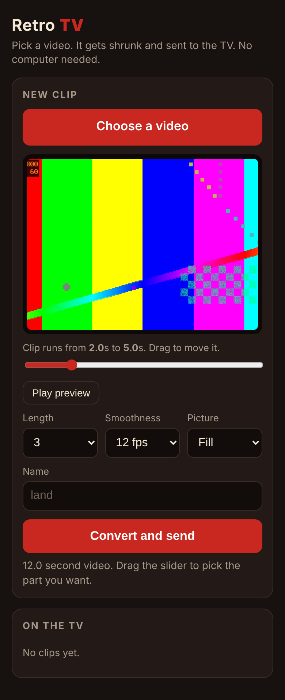

# Retro TV Desk Charm

A tiny 3D printed retro TV that loops short video clips on your desk. You send clips to it straight from your phone over WiFi. No app, no computer, no cables after the first setup.

> **Status:** working prototype. Plays clips, takes uploads from a phone, housing fits. Paint and final photos still to come.

<!-- TODO: put your best photo or a 10 second GIF here. This is the most important thing on the page. -->
<!--  -->

## What it does

- **Loops video clips** from a microSD card on a 2.8 inch screen (320 x 240).
- **Phone upload over WiFi.** The TV serves its own web page. Pick a video, choose the start point and length, tap send.
- **Converts in the browser.** The phone turns the video into the format the TV needs, so the TV never has to do heavy work.
- **Clip manager.** Play or delete any clip from the same page.
- **Brightness control** that the TV remembers when unplugged.
- **Turnable magnetic knobs** and a filament-rod antenna, because it is a TV.

## Parts

| Part | Notes |
|---|---|
| ESP32-2432S028R ("Cheap Yellow Display") | 2.8 inch ILI9341 touchscreen board. Mine is the two-port version (micro-USB and USB-C). |
| microSD card | Must be **FAT32**. exFAT cards are not read. |
| 4 x disc magnets, 5 x 2 mm | One in each knob, one in each socket. |
| 2 x M3 x 6 mm hex screws | Hold the board in the body. |
| 2 x M3 nuts | Used as spacers under the screw heads. The 6 mm screws were too long for the inserts on their own. |
| M3 brass threaded inserts, about 3 mm long | Set into the body so the screws bite into metal, not plastic. <!-- TODO: confirm exact insert size from the bag --> |
| 1.75 mm filament offcuts | Used as dowel pins and as the antenna rods. |
| USB-C cable | Power only. |
| PLA | Printed on an Ender 3 Pro. |

## How it works



**MJPEG in one line:** a video stored as a stack of ordinary JPEG pictures, one per frame. It is a bigger file than a normal video, but it is simple enough for a small chip to decode.

### Firmware

- Arduino sketch for the ESP32 (Arduino core 3.x), about 830 lines.
- Starts its own WiFi network (`RetroTV`), or joins home WiFi if the SD card has a `wifi.txt` file. On home WiFi the page is at `http://retrotv.local`.
- Web server routes: `/` (the page), `/list`, `/play`, `/delete`, `/upload`, `/light`.
- **Uploads never interrupt a frame.** A new clip is written to a temp file, then swapped in between clips.
- **Frame skipping.** If the board cannot keep up, it drops frames instead of slowing down, so a 5 second clip still takes 5 seconds.
- **Oversized frames are handled safely.** A frame larger than the buffer stops that clip instead of overflowing memory.
- Clip speed is stored in the file name, for example `beach.f12.mjpeg` plays at 12 frames a second.

### Phone page



- One HTML file (about 14 KB) stored inside the firmware.
- Live preview while you drag the start slider, plus a "Play preview" button.
- Fast conversion: plays the video at 2x and grabs frames as they appear (`requestVideoFrameCallback`). Older browsers fall back to a slower frame-by-frame method.
- Frames that come out too big are re-compressed before sending.

### Housing

- Modelled in code (Python with `trimesh` and `manifold3d`), not in a CAD program. Every dimension is a named number in one script, so a fit problem is a one line change and a re-export.
- Built around an existing CYD front case so the board seat was already proven.
- Printed parts: body, stand, 2 knobs, antenna base, 2 antenna tips. <!-- TODO: add the rear cap back to this list if you kept it -->
- **No printed back cover.** The board is screwed straight into the body with M3 brass threaded inserts and hex screws, so it can come out and go back in without wearing out the plastic.
- Small fit-test pieces (USB and SD end, one knob socket) so I could check fit with a short print instead of reprinting the whole body.

## Design log

Eight housing revisions. Each one came from a real print and a real problem.

| Problem found on the print | Fix |
|---|---|
| Shell blocked the USB-C port (I had only opened the micro-USB side) | Opened the USB-C side, then narrowed it to a port-only window |
| Rear cap would not sit flush and warped | Redesigned as a thicker cap with a lip and pegs |
| SD card sat too deep to pull out | Added a finger scoop and a guided slot |
| Unused connectors and bare board visible | Covered them, added a faceplate around USB-C |
| Screen sat too far behind the front (2.6 mm) | Removed an extra lip, now 1.0 mm |
| Knob panel printed as loose strands | A wide recess on the bed side was printing in mid-air. Replaced with a flat panel and a thin outline groove |
| Whole body was exported upside down | Re-exported front face down |
| Printed back cover did not hold tight | Dropped it. M3 brass threaded inserts in the body, board held with M3 hex screws |

**Lessons I would reuse:**

1. **Print a small test piece first.** Most fit bugs showed up on a small test piece, not the full body.
2. **Nothing wide and hollow on the bed-side face.** It has to bridge in mid-air.
3. **Check orientation in the slicer every time.** One wrong flip hid behind several "print quality" problems.

## Performance

Measured on the real board, from the serial log:

| Clip target | What the board managed |
|---|---|
| 15 fps | 11.8 to 11.9 fps |

So the practical ceiling is **about 12 fps at 320 x 240**. The page defaults to 12 fps for that reason, and frame skipping covers the 15 fps option.

Likely bottlenecks, not yet measured separately: reading from the SD card, JPEG decoding, and pushing pixels over SPI. The firmware prints a per-frame timing breakdown to help find out which.

## Testing

- **Phone page:** automated browser tests (Playwright) against a mock TV server. Covers preview scrubbing, landscape and portrait video, fill and fit, name cleaning, oversized frames, and the older-browser path.
- **Firmware logic:** the real sketch compiled on a PC with stand-in hardware headers and the real JPEG decoder, run under AddressSanitizer. 43 checks across four boot scenarios (own network, empty card, home WiFi, home WiFi unreachable). This caught two memory bugs in the original MJPEG reader.
- **Real hardware:** playback and WiFi upload confirmed on the board. The brightness slider is checked in simulation only so far.

Run them yourself:

```bash
tests/page/run_tests.sh   # phone page, needs Python and Playwright
tests/sim/run_sim.sh      # firmware logic, needs g++ and git
```

## Limits

- No sound.
- Up to 40 clips, up to 30 seconds each.
- About 12 fps.
- FAT32 cards only.
- WiFi networks that need a username (like eduroam) do not work.
- The stand's second pin hole misses the frame, so it uses one pin plus glue.

## What I would do next

- Find the real fps bottleneck with the timing report, then try lighter JPEGs or splitting decode and draw across the two CPU cores.
- An ESP32-S3 board for 24 fps and sound.
- Battery and charging in the empty space at the back.
- Fix the stand pin hole.

## What is in this repo

| Folder | What |
|---|---|
| `firmware/RetroTV_Player/` | The Arduino sketch. `webpage.h` is the phone page stored as a string. |
| `firmware/page/` | The phone page source (`index.html`). |
| `case/` | The Python script that builds the housing, and the printable STL files. |
| `tests/` | Browser tests for the page and the PC simulation of the firmware. |
| `docs/img/` | Pictures. |

## Build it

1. **Flash:** open `firmware/RetroTV_Player/RetroTV_Player.ino` in Arduino IDE, board "ESP32 Dev Module", install the libraries *GFX Library for Arduino* and *JPEGDEC*, upload. Set `SCREEN_ROTATION` to 1 or 3 if the picture is upside down.
2. **Card:** format a microSD as FAT32 and insert it.
3. **Print:** body front face down.
4. **Mount the board:** set the M3 brass inserts into the body, then fasten the board with the two M3 x 6 mm hex screws, with an M3 nut on each screw as a spacer.
5. **Send a clip:** join the `RetroTV` WiFi, open `http://192.168.4.1`, choose a video.

Full steps are in `firmware/RetroTV_Player/README.txt`.

## Credits

- Video player based on [esp32-2432S028_video_player](https://github.com/thelastoutpostworkshop/esp32-2432S028_video_player) by thelastoutpostworkshop (MIT license, included).
- Libraries: [Arduino_GFX](https://github.com/moononournation/Arduino_GFX), [JPEGDEC](https://github.com/bitbank2/JPEGDEC).
- The TV body is a remix of [ESP32 2.8inch CYD LCD screen case](https://www.printables.com/model/645166-esp32-28inch-touch-ips-cyd-lcd-screen-case) by jeepers01, licensed [CC BY-SA 4.0](https://creativecommons.org/licenses/by-sa/4.0/). Changes: the original front case is kept as the board seat and a retro TV shell is built around it, with a USB-C opening, SD card scoop, knob sockets and covered-up unused ports. <!-- TODO: confirm this is the page you downloaded from, then delete this note -->
- Built with AI assistance (Claude) for the modelling scripts and firmware. I set the requirements, printed and tested every revision, and decided what to change.

## License

- **Code** (firmware, phone page, scripts, tests): MIT, see `LICENSE`.
- **STL files in `case/stl/`:** [CC BY-SA 4.0](https://creativecommons.org/licenses/by-sa/4.0/), see `case/LICENSE.md`. The body is a remix of a CC BY-SA case, so it has to carry the same license. The other parts use it too so the whole print has one license.
